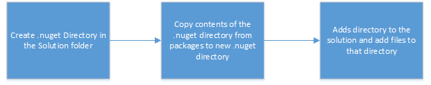
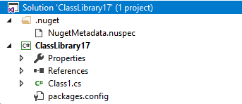
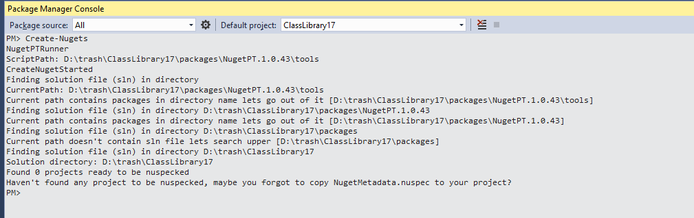
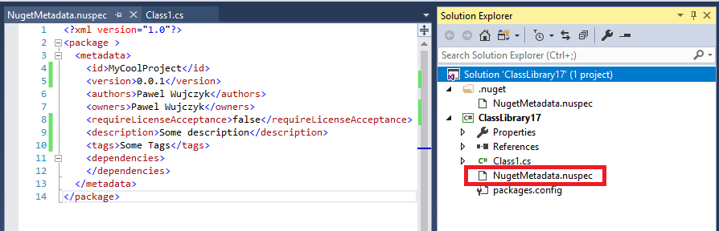
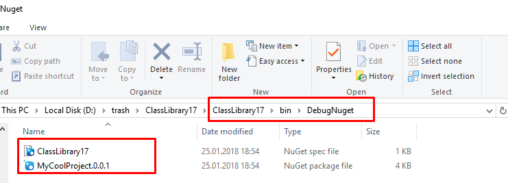
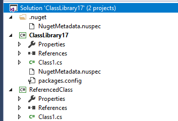
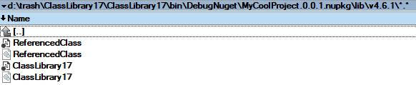
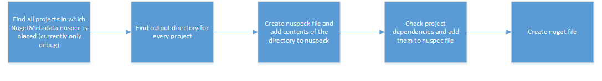

<!--Category:Powershell,C#--> 
 <p align="right">
    <a href="https://www.powershellgallery.com/packages/ProductivityTools.ConvertTcx2Gpx/"></a>
    <a href="http://productivitytools.top/convert-tcx-to-gpx/"><a> 
    <a href="https://github.com/pwujczyk/ProductivityTools.ConvertTcx2Gpx"></a>
</p>
<p align="center">
    <a href="http://productivitytools.tech/">
        
    </a>
</p>

# NugetTools 

NugetPT is nuget which allows to create nugets from projects in the solution. It is designed for .NET application, currently .NET standard and .NET core are crating nugets automatically.

<!--more-->


## Installation
Nuget can be installed like any other using command
Install-Package NugetPT
During installation Package Manager downloads Nuget from repository and extracts its to package directory. After this Package Manager runs Init.ps1 and Install.ps1.

- Init.ps1 – file is executed every time project with NugetPT is opened in Visual Studio. Init.ps1 from NugetPT register module which exposes Create-Nuget command.
- Install.ps1 – file is executed only once when nuget is installed (somewhere in the internet it is written that - Install file is not supported in visual studio 2017 but this is not true).

## Install.ps1

It performs set of steps to prepare solution to be _NugetPT ready_



After the process occurs in Visual Studio we should see following structure.



At this moment in the Package Manager Console it should be option to create nugets. But we need to perform additional action to be able to create packages.



To be able to create nugets copy NugetMetadata.nuspec to the project which should generate nuget. Next update file according to requirements.



Now Create-Nugets command can be invoked and Nuget should be created (don’t forget to build project!)

```powershell
PM> Create-Nugets
NugetPTRunner
ScriptPath: D:\trash\ClassLibrary17\packages\NugetPT.1.0.43\tools
CreateNugetStarted
Finding solution file (sln) in directory 
CurrentPath: D:\trash\ClassLibrary17\packages\NugetPT.1.0.43\tools
Current path contains packages in directory name lets go out of it [D:\trash\ClassLibrary17\packages\NugetPT.1.0.43\tools]
Finding solution file (sln) in directory D:\trash\ClassLibrary17\packages\NugetPT.1.0.43
Current path contains packages in directory name lets go out of it [D:\trash\ClassLibrary17\packages\NugetPT.1.0.43]
Finding solution file (sln) in directory D:\trash\ClassLibrary17\packages
Current path doesn't contain sln file lets search upper [D:\trash\ClassLibrary17\packages]
Finding solution file (sln) in directory D:\trash\ClassLibrary17
Solution directory: D:\trash\ClassLibrary17
Found 1 projects ready to be nuspecked
Processing Project D:\trash\ClassLibrary17\ClassLibrary17\ClassLibrary17.csproj
ClassLibrary17.csproj


Name : files
LocalName : files
NamespaceURI : 
Prefix : 
NodeType : Element
ParentNode : package
OwnerDocument : #document
IsEmpty : True
Attributes : {}
HasAttributes : False
SchemaInfo : System.Xml.XmlName
InnerXml : 
InnerText : 
NextSibling : 
PreviousSibling : metadata
Value : 
ChildNodes : {}
FirstChild : 
LastChild : 
HasChildNodes : False
IsReadOnly : False
OuterXml : <files />
BaseURI : 
PreviousText :

src : D:\trash\ClassLibrary17\ClassLibrary17\bin\Debug\ClassLibrary17.dll
target : lib\v4.6.1\

src : D:\trash\ClassLibrary17\ClassLibrary17\bin\Debug\ClassLibrary17.pdb
target : lib\v4.6.1\

Finding solution file (sln) in directory 
CurrentPath: D:\trash\ClassLibrary17\packages\NugetPT.1.0.43\tools
Current path contains packages in directory name lets go out of it [D:\trash\ClassLibrary17\packages\NugetPT.1.0.43\tools]
Finding solution file (sln) in directory D:\trash\ClassLibrary17\packages\NugetPT.1.0.43
Current path contains packages in directory name lets go out of it [D:\trash\ClassLibrary17\packages\NugetPT.1.0.43]
Finding solution file (sln) in directory D:\trash\ClassLibrary17\packages
Current path doesn't contain sln file lets search upper [D:\trash\ClassLibrary17\packages]
Finding solution file (sln) in directory D:\trash\ClassLibrary17
Solution directory: D:\trash\ClassLibrary17
invoking command D:\trash\ClassLibrary17\.nuget\Nuget.exe pack D:\trash\ClassLibrary17\ClassLibrary17\bin\DebugNuget\ClassLibrary17.nuspec -OutputDirectory D:\trash\ClassLibrary17\ClassLibrary17\bin\DebugNuget
Attempting to build package from 'ClassLibrary17.nuspec'.
Successfully created package 'D:\trash\ClassLibrary17\ClassLibrary17\bin\DebugNuget\MyCoolProject.0.0.1.nupkg'.
```

Module is very _chatty_ to help in debugging.

Created nuget can be found in the directory DebugNuget placed on the same level as Debug directory



## Project which references different project

If our project references different project or have his own dependencies those are also reflected in the final nuget.


Previous configuration will result in following nuget:



## Couple nugets from one project
Adding NugetMetadata.nuspec to two projects in one solution will result in two nugets.

## General nuget creation process




## Debugging
It is extreamly easy to debug creating nuget module. Go to NugetPT package directory and open NugetPTRunner.ps1 in some powershell tool.

To debug Install.ps1 you need to run the Script in Package Manager Console and invoking code there changing it in external text editor.

## Pushing nugets from Visual Studio
Module also helps to push nugets to nuget.org

First setup ApiKey using

### SetApiKey apiKey

And next

Push-Nugets

This is not part of the module, but to make article comprehensive:

- Generate API key from nuget.org.
- Add your API key to VS configuration using command (in - Package Manager Console) nuget setApiKey yourapikey
push using command: nuget push YourPackage.nupkg -Source https://api.nuget.org/v3/index.json
 

### Playground
I created project which uses this package it can be found on the [github](https://github.com/pwujczyk/NugetPTExample). It contains all elements of the solution together with the .dll files.

